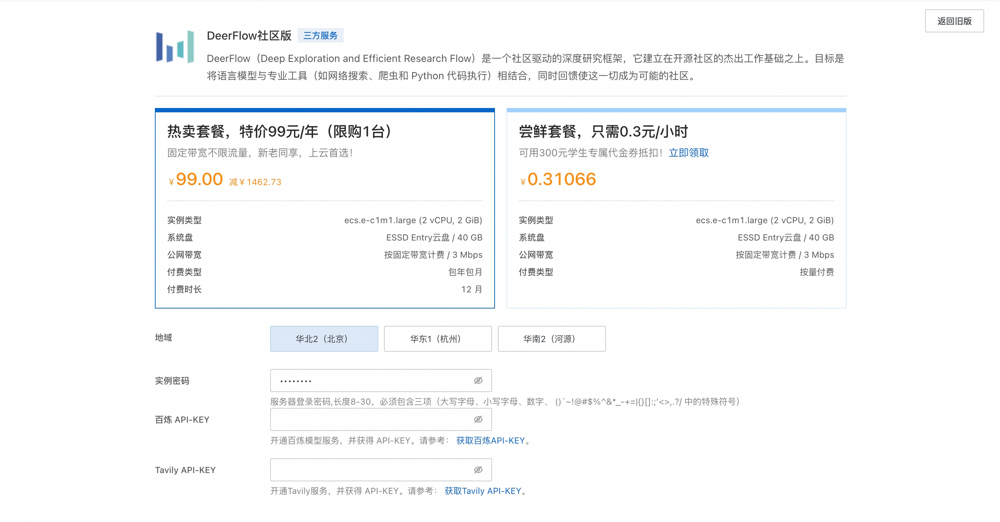
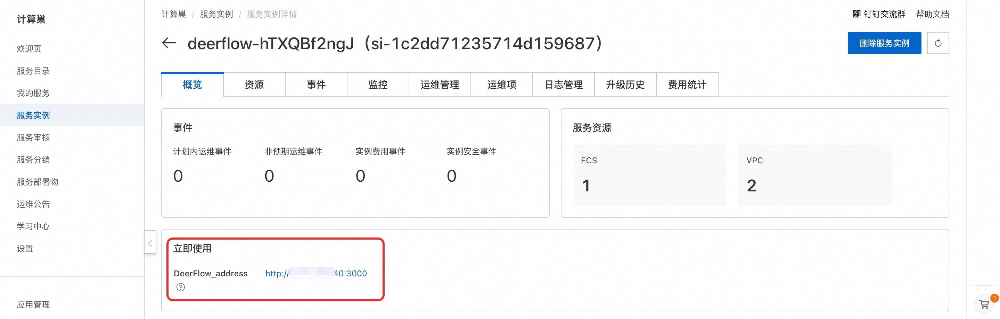

# DeerFlow社区版快速部署

## 概述
**DeerFlow**（**D**eep **E**xploration and **E**fficient **R**esearch **Flow**）是一个社区驱动的深度研究框架，它建立在开源社区的杰出工作基础之上。我们的目标是将语言模型与专业工具（如网络搜索、爬虫和 Python 代码执行）相结合，同时回馈使这一切成为可能的社区。 访问[DeerFlow 的官方网站](https://deerflow.tech/)了解更多详情。

## 计费说明
DeerFlow社区版上的费用主要涉及：

- 所选vCPU与内存规格
- 系统盘类型及容量
- 公网带宽

## RAM账号所需权限
部署DeerFlow社区版，需要对部分阿里云资源进行访问和创建操作。因此您的账号需要包含如下资源的权限。
  **说明**：当您的账号是RAM账号时，才需要添加此权限。

| 权限策略名称                          | 备注                                 |
|---------------------------------|------------------------------------|
| AliyunECSFullAccess             | 管理云服务器服务（ECS）的权限                   |
| AliyunVPCFullAccess             | 管理专有网络（VPC）的权限                     |
| AliyunROSFullAccess             | 管理资源编排服务（ROS）的权限                   |
| AliyunComputeNestUserFullAccess | 管理计算巢服务（ComputeNest）的用户侧权限         |

## 部署流程
1. 访问DeerFlow社区版服务[部署链接](https://computenest.console.aliyun.com/service/simple/deploy?ServiceId=service-7d76424edd5d434794a9)，按提示填写部署参数：
    

2. 参数填写完成后可以看到对应询价明细，确认参数后点击**下一步：确认订单**。 确认订单完成后同意服务协议并点击**立即创建**进入部署阶段。

3. 等待部署完成后进入服务实例管理, 在控制台找到DeerFlow服务访问链接。
    

4. 单击链接访问服务。
    
